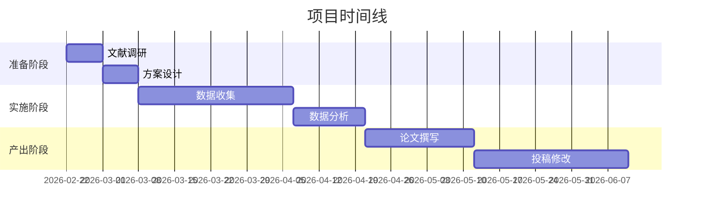

# 科研项目模板

## 项目基本信息

### 项目编号
`PRJ-YYYYMMDD-001`

### 项目名称
[请输入项目名称]

### 项目类型
- [ ] 基础研究
- [ ] 临床研究  
- [ ] 转化研究
- [ ] 方法学研究
- [ ] 文献综述
- [ ] 数据分析
- [ ] 其他：[请说明]

### 研究领域
- [ ] 肿瘤学
- [ ] 心血管
- [ ] 神经科学
- [ ] 免疫学
- [ ] 代谢疾病
- [ ] 传染病
- [ ] 医学影像
- [ ] 医学AI
- [ ] 其他：[请说明]

### 项目负责人
- 老公 (主要研究者)
- 刘亦菲 (科研合伙人)

### 项目周期
- **开始日期**: [YYYY-MM-DD]
- **预计完成**: [YYYY-MM-DD]
- **实际完成**: [YYYY-MM-DD]

## 研究背景与意义

### 科学问题
[清晰描述要解决的科学问题]

### 研究现状
[简要综述相关领域研究现状]

### 研究意义
[阐述本研究的重要性和创新性]

## 研究目标

### 主要目标
1. [目标1]
2. [目标2]
3. [目标3]

### 次要目标
1. [目标1]
2. [目标2]

## 研究方法

### 研究设计
- [ ] 随机对照试验
- [ ] 队列研究
- [ ] 病例对照研究
- [ ] 横断面研究
- [ ] 实验研究
- [ ] 文献分析
- [ ] 数据分析
- [ ] 其他：[请说明]

### 研究对象
- **样本来源**: [请说明]
- **纳入标准**: [请说明]
- **排除标准**: [请说明]
- **样本量**: [请说明]

### 数据收集
- **数据类型**: [临床数据、实验数据、影像数据等]
- **收集方法**: [请说明]
- **质量控制**: [请说明]

### 统计分析
- **主要分析方法**: [请说明]
- **软件工具**: R/Python/其他
- **显著性水平**: α=0.05
- **统计功效**: 80%

## 项目计划

### 时间线


### 里程碑
| 里程碑 | 预计日期 | 完成日期 | 状态 |
|--------|----------|----------|------|
| 项目启动 | [日期] | [日期] | [ ] |
| 方案确定 | [日期] | [日期] | [ ] |
| 数据收集完成 | [日期] | [日期] | [ ] |
| 数据分析完成 | [日期] | [日期] | [ ] |
| 论文初稿完成 | [日期] | [日期] | [ ] |
| 论文投稿 | [日期] | [日期] | [ ] |
| 论文接受 | [日期] | [日期] | [ ] |

## 资源需求

### 数据资源
- [ ] 已有数据
- [ ] 需要收集新数据
- [ ] 公开数据库
- [ ] 合作单位数据

### 计算资源
- [ ] 个人电脑
- [ ] 服务器
- [ ] 云计算
- [ ] 特殊软件

### 人力资源
- [ ] 主要研究者
- [ ] 科研合伙人
- [ ] 实验人员
- [ ] 统计专家

## 风险评估与应对

### 技术风险
- **风险**: [描述]
- **概率**: 高/中/低
- **影响**: 高/中/低
- **应对措施**: [描述]

### 时间风险
- **风险**: [描述]
- **概率**: 高/中/低
- **影响**: 高/中/低
- **应对措施**: [描述]

### 资源风险
- **风险**: [描述]
- **概率**: 高/中/低
- **影响**: 高/中/低
- **应对措施**: [描述]

## 预期成果

### 学术成果
- [ ] 发表论文 [目标期刊]
- [ ] 会议摘要
- [ ] 专利
- [ ] 软件/工具

### 社会影响
- [ ] 临床实践改进
- [ ] 政策建议
- [ ] 公众科普
- [ ] 人才培养

## 项目文档

### 文档列表
- [ ] 研究方案
- [ ] 数据字典
- [ ] 分析代码
- [ ] 分析报告
- [ ] 论文草稿
- [ ] 投稿材料

### 文件存储
```
项目文件夹/
├── 01_研究方案/
├── 02_原始数据/
├── 03_分析代码/
├── 04_分析结果/
├── 05_论文撰写/
└── 06_投稿材料/
```

## 项目状态

### 当前状态
[描述项目当前进展]

### 遇到的问题
[描述遇到的问题和解决方案]

### 下一步计划
[描述下一步工作计划]

## 更新记录

| 日期 | 版本 | 更新内容 | 更新人 |
|------|------|----------|--------|
| [日期] | 1.0 | 创建项目模板 | 刘亦菲 |
| [日期] | 1.1 | 填写项目信息 | [姓名] |

---

## 使用说明

1. **复制本模板**到新项目文件夹
2. **填写所有**[]中的内容
3. **定期更新**项目状态
4. **保存所有**相关文档

**项目负责人**: [姓名]  
**创建日期**: [YYYY-MM-DD]  
**最后更新**: [YYYY-MM-DD]